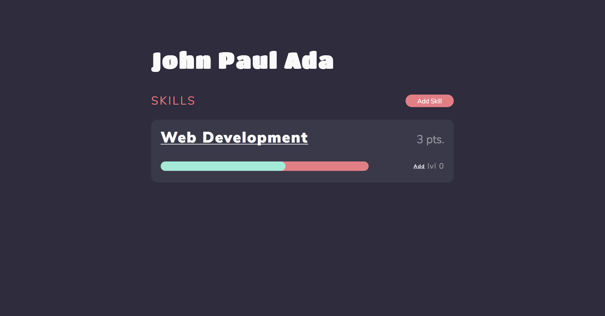
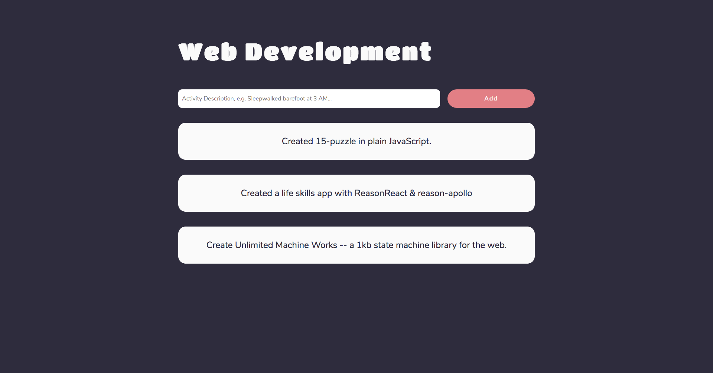

# Life Skill Stats
Stats of my selected skills in life.

## Screenshot

## Development
1. Install [Yarn](https://yarnpkg.com).
2. Run `yarn` to install dependencies.
3. Install [Serve](https://www.npmjs.com/package/serve).
4. Install [bashful](https://github.com/wagoodman/bashful).
5. Run `bashful run dev.yaml` to run the dev server.